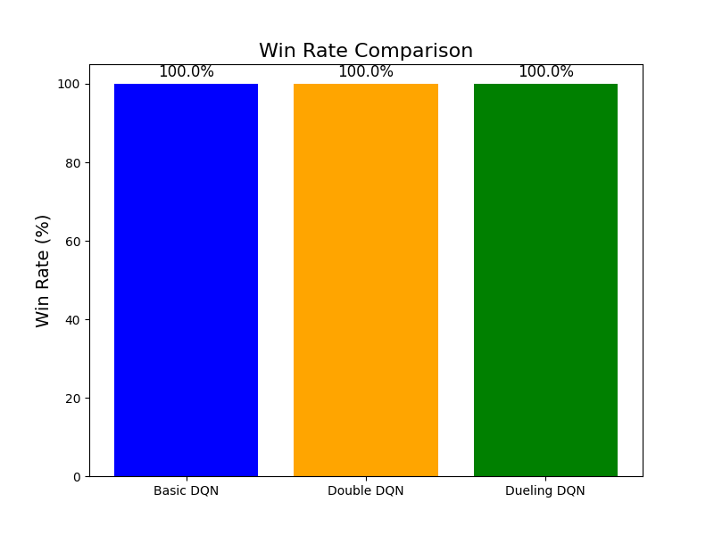
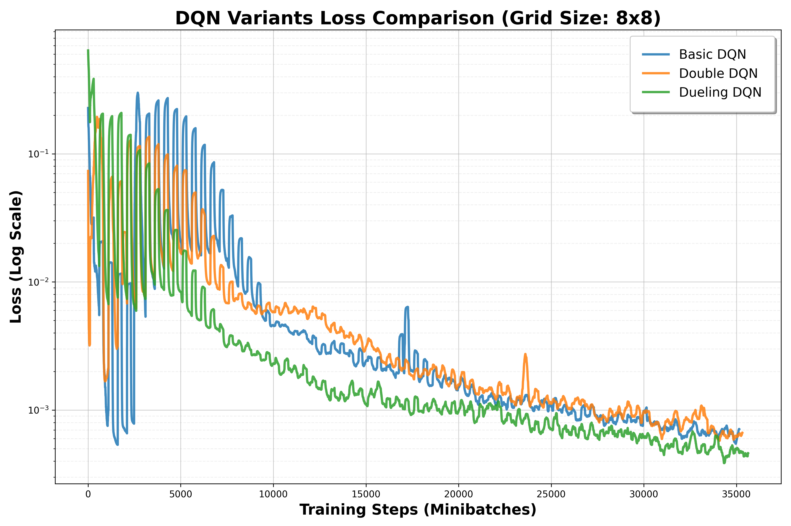
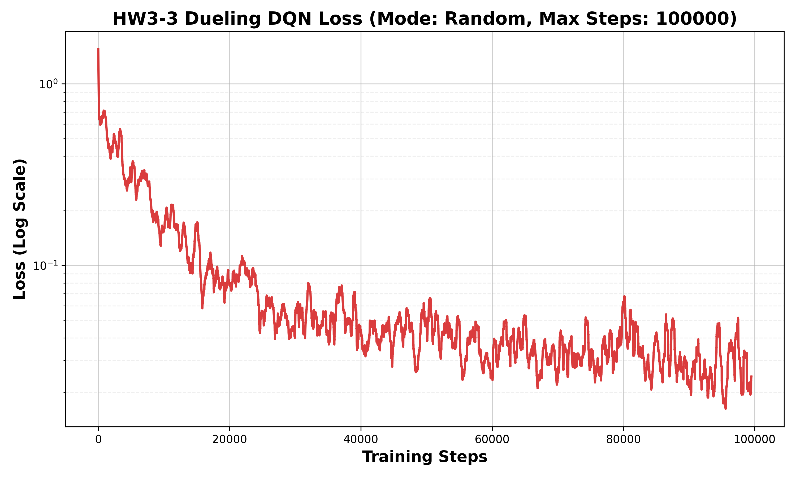
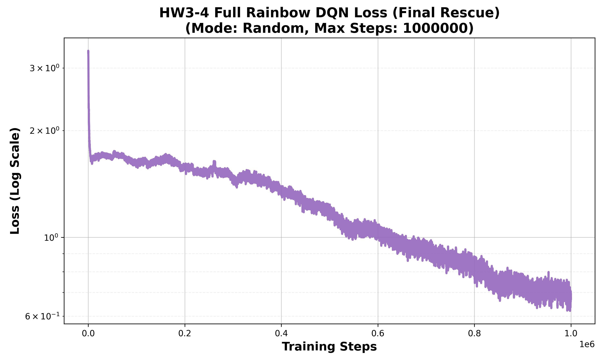

# HW3 Deep Q-Learning (DQN) — Gridworld Experiments

A comprehensive implementation of Deep Q-Learning algorithms applied to a 4×4 Gridworld environment, progressively evolving from a Basic DQN to a **Full Rainbow DQN** using the PyTorch Lightning framework.

---

## 📂 Project Structure

```
HW3_DQN/
│
├── Gridworld.py          # Gridworld environment logic
├── GridBoard.py          # Underlying board representation
├── baseline.ipynb        # Original baseline notebook (reference)
├── baseline.py           # Converted baseline script
│
├── hw3_2.py              # HW3-2: Compare Basic DQN, Double DQN, Dueling DQN
├── hw3_3.py              # HW3-3: PyTorch Lightning refactor with training tips
├── hw3_4_rainbow.py      # HW3-4: Full Rainbow DQN (Ultimate Challenge)
│
├── requirements.txt      # Core dependencies
└── .gitignore
```

---

## 🧪 Experiments Overview

### HW3-2 — Comparing DQN Variants (`hw3_2.py`)
Trains and evaluates **three DQN architectures** side-by-side in `mode='player'` (randomized start positions).

| Agent | Description |
|---|---|
| **Basic DQN** | Baseline DQN with experience replay and target network |
| **Double DQN** | Decouples action selection (main net) from Q-value evaluation (target net) |
| **Dueling DQN** | Splits network into Value stream + Advantage stream; $Q = V + A - \text{mean}(A)$ |

**Outputs:** `hw3_2_loss.png`, `win_rate_comparison.png`

---

### HW3-3 — PyTorch Lightning Refactor (`hw3_3.py`)
Refactors the DQN training loop into a `pl.LightningModule` with advanced stability techniques, trained in the harder `mode='random'` environment.

**Bonus Training Techniques:**
- 🎯 **Soft Target Network Update** (Polyak Averaging, τ=0.005) — smoothly blends weights to stabilize training
- ✂️ **Gradient Clipping** (`gradient_clip_val=1.0`) — prevents exploding gradients
- 📉 **Learning Rate Scheduling** (`StepLR`) — fine-tunes convergence in later stages
- 🔻 **Epsilon Decay** tied to `global_step` — smooth 1.0 → 0.1 decay

**Architecture:** Dueling DQN with a custom `RLDataset` (`IterableDataset`) for seamless Lightning integration.

**Output:** `hw3_3_loss.png`

---

### HW3-4 — Full Rainbow DQN (`hw3_4_rainbow.py`)
The **ultimate challenge**: implements all 6 Rainbow DQN components on the hardest `mode='random'` environment.

#### 🌈 Rainbow Components

| # | Component | Description |
|---|---|---|
| 1 | **Double DQN** | Main net selects action; target net evaluates Q-value |
| 2 | **Dueling DQN** | Separate Value + Advantage streams |
| 3 | **Noisy Nets** | Replaces ε-greedy with learnable Gaussian weight noise (`NoisyLinear`) |
| 4 | **N-step Returns** | N=3; accumulates discounted rewards to combat sparse rewards |
| 5 | **Prioritized Experience Replay (PER)** | SumTree-based sampling; IS weights with β-annealing (0.4 → 1.0) |
| 6 | **Distributional RL (C51)** | Predicts full return distribution over 51 atoms in [−20, 20] |

#### Key Hyperparameters
| Parameter | Value |
|---|---|
| `MAX_STEPS` | 1,000,000 |
| `BATCH_SIZE` | 256 |
| `N_STEP` | 3 |
| `N_atoms` | 51 |
| `V_min / V_max` | −20 / 20 |
| `PER alpha` | 0.6 |
| `PER beta_start` | 0.4 |
| `Soft Update τ` | 0.005 |
| `Learning Rate` | 1e-4 |
| `Gradient Clip` | 1.0 |

**Output:** `hw3_4_full_rainbow_final.png`

---

## 🚀 How to Run

### 1. Setup Environment
```powershell
# Create virtual environment
python -m venv .venv
.\.venv\Scripts\activate

# Install dependencies (CPU)
pip install -r requirements.txt

# Or install with CUDA 12.8 GPU support
pip install torch torchvision --index-url https://download.pytorch.org/whl/cu128
pip install pytorch-lightning torchmetrics matplotlib ipython notebook tqdm
```

### 2. Run Experiments
```powershell
# HW3-2: Compare Basic / Double / Dueling DQN
.\.venv\Scripts\python.exe hw3_2.py

# HW3-3: PyTorch Lightning DQN
.\.venv\Scripts\python.exe hw3_3.py

# HW3-4: Full Rainbow DQN (Long training, recommended with GPU)
.\.venv\Scripts\python.exe hw3_4_rainbow.py
```

---

## 📊 Results

### HW3-2 Win Rate Comparison (mode='player', 8×8 Grid)


### HW3-2 Loss Curve


### HW3-3 Loss Curve (PyTorch Lightning, mode='random')


### HW3-4 Full Rainbow Loss (mode='random')


---

## 🛠️ Environment

| Item | Version |
|---|---|
| Python | 3.13 |
| PyTorch | 2.11.0+cu128 |
| PyTorch Lightning | 2.6.1 |
| CUDA | 12.8 |
| GPU | NVIDIA GeForce RTX 2080 Ti |

---

## 📚 References

- [Rainbow: Combining Improvements in Deep Reinforcement Learning (Hessel et al., 2017)](https://arxiv.org/abs/1710.02298)
- [Deep Reinforcement Learning *in Action* — Manning Publications](https://www.manning.com/books/deep-reinforcement-learning-in-action)
- [Prioritized Experience Replay (Schaul et al., 2015)](https://arxiv.org/abs/1511.05952)
- [A Distributional Perspective on Reinforcement Learning / C51 (Bellemare et al., 2017)](https://arxiv.org/abs/1707.06887)
- [Noisy Networks for Exploration (Fortunato et al., 2017)](https://arxiv.org/abs/1706.10295)
